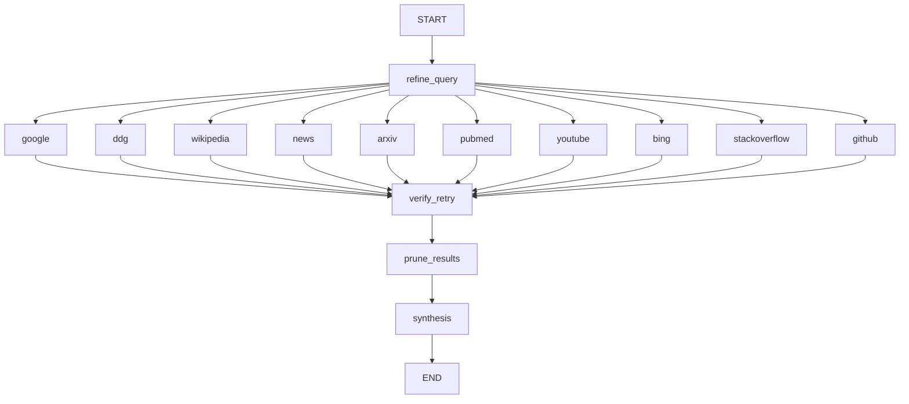

# 🧠 Agente de Investigación Multi-Fuente con LangGraph

## Resumen

Este proyecto implementa un agente de investigación multi-fuente basado en [LangGraph](https://github.com/langchain-ai/langgraph), un framework de orquestación en forma de grafo para agentes de lenguaje. El agente afina consultas con un LLM, ejecuta búsquedas paralelas en múltiples fuentes, filtra resultados irrelevantes y sintetiza un informe final.

---

## 🔍 Características

- Afinamiento de consultas (DeepSeek) para adaptar y optimizar búsquedas.
- Búsquedas multi-fuente (Google, DuckDuckGo, Wikipedia, News, ArXiv, PubMed, YouTube, Bing, Stack Overflow, GitHub, etc.).
- Reintentos automáticos y manejo de errores configurables (MAX_RETRIES).
- Filtrado y poda basada en LLM para reducir ruido.
- Síntesis final con un resumen estructurado de los hallazgos.

---

## 📦 Instalación

Requisitos: Python 3.8+ y pip, o usar Poetry si prefieres.

1. Clona el repositorio:

```powershell
git clone https://github.com/your-username/research-agent.git
cd research-agent
```

2. (Opcional) Crear y activar un entorno virtual (Windows PowerShell):

```powershell
python -m venv .venv
.\.venv\Scripts\Activate.ps1
# Si usas cmd.exe: .\.venv\Scripts\activate.bat
```

3. Instalar dependencias:

```powershell
pip install -r requirements.txt
# o con poetry:
# poetry install
```

4. Añadir variables de entorno (ejemplo `.env`):

```
OPENAI_API_KEY=tu_openai_key
EMAIL=tu_email_para_entrez
```

Asegúrate de no subir credenciales a repositorios públicos.

---

## 🚀 Uso

Ejecuta el agente principal (o ajusta el fichero `src/main.py` según tu flujo):

```powershell
python src/main.py
```

También puedes modificar la variable `question` en `main.py` para probar distintas consultas.

---

## 🧩 Arquitectura (resumen)

El flujo general del agente es:

- Refinar la consulta con el LLM
- Ejecutar búsquedas en paralelo en múltiples fuentes
- Reintentar fallos hasta `MAX_RETRIES`
- Podar resultados irrelevantes con prompts de LLM
- Sintetizar un informe final

Diagrama (mermaid):



> Nota: Para visualizar el diagrama mermaid necesitas un renderizador compatible (GitHub lo soporta en la web, algunos editores requieren plugins).

---

## 🛠️ Registro de herramientas y catálogo

Las herramientas se cargan mediante `setup_all_tools()` y se almacenan en `agent_tools`.

Ejemplo de construcción de catálogo:

```python
from src.tools.setup_tools import setup_all_tools
setup_all_tools()

from src.tools.registry.shared_registry import agent_tools

tool_catalog = {
    agent_name.replace("_agent", ""): tools
    for agent_name, tools in agent_tools.items()
}

# Número total de herramientas registradas:
# total = sum(len(tools) for tools in agent_tools.values())
```

Se verifica la consistencia entre agentes registrados y el catálogo.

---

## 🧮 Ejemplo de salida (síntesis)

**Consulta original:** what are R1b haplogroups?

**Consulta optimizada (DeepSeek):** R1b haplogroup genetic ancestry

### Google
R1b es un haplogrupo mayor del cromosoma Y frecuente en Europa occidental...

### PubMed
**Título:** Genetic structure of R1b lineages in Europe
**Fecha:** 2021
**Enlace:** https://pubmed.ncbi.nlm.nih.gov/12345678/

... (salida de ejemplo resumida)

---

## ✅ Comprobaciones internas (consistencia)

Se realiza una verificación para comprobar que todos los agentes registrados aparecen en el catálogo. Si faltase alguno, se imprime una advertencia para añadirlo manualmente.

---

## 📄 Licencia

MIT License. Ver el fichero `LICENSE` para más detalles.

---

## 🤝 Contribuir

Se aceptan pull requests. Para cambios importantes, abre un issue primero para discutir la propuesta.

---

## 👤 Autor

Desarrollado por Francesc Sánchez Parés

---

*README actualizado: limpieza de formato, corrección de bloques de código y adición de instrucciones claras de instalación/uso (incl. Windows PowerShell).*
